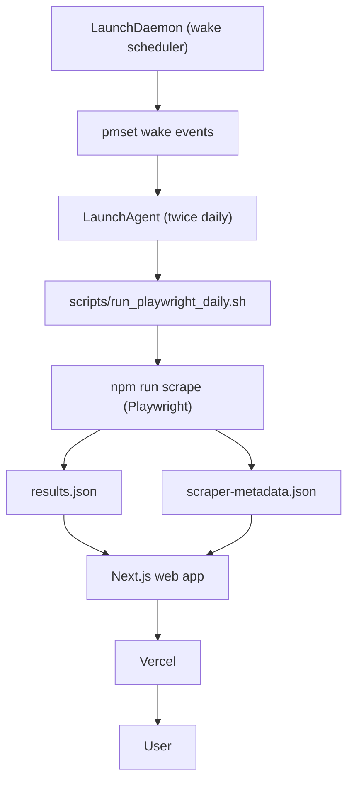

# Setup Scheduled Scraper

## Overview

Build a local, scheduled scraper that runs via Playwright and writes JSON results, with an optional Next.js viewer for tables/charts. Default stack: TypeScript, Playwright test runner, Next.js App Router, Tailwind v4, Shadcn UI, and launchd scheduling.

## Workflow

1. Intake the request (read `references/intake.md`).
2. Scaffold the project (Next.js app + Playwright + TypeScript).
3. Implement the scraper pipeline (URLs -> parsed data -> JSON).
4. Add the optional viewer (read-only).
5. Add scheduling + logging with launchd.
6. Verify manual run, schedule, and viewer.

## Example Project Structure

```
project/
├── src/
│   ├── app/
│   │   ├── layout.tsx            # Next.js root layout
│   │   └── page.tsx              # Viewer entry page
│   ├── launchd/
│   │   ├── com.example.scraper.plist       # LaunchAgent schedule
│   │   └── com.example.scraper-wake.plist  # LaunchDaemon wake helper
│   ├── lib/                      # Viewer helpers
│   ├── scraper.ts                # Playwright entry (called by test spec)
│   └── scrape.spec.ts            # Playwright spec that invokes scraper
├── scripts/
│   ├── clear_logs.sh             # Clears scheduler logs
│   ├── run_playwright_daily.sh   # Scheduled wrapper (logs + npm run scrape)
│   ├── update-schedule.sh        # Updates launchd schedule times
│   └── schedule-wakes.sh         # Optional pmset wake scheduling
├── results.json                  # Scheduled output (read-only)
├── results-local.json            # Manual run output
├── scraper-metadata.json         # Run metadata
├── package.json
├── tsconfig.json
└── README.md
```

### Example system architecture



## Data conventions

- Use `results.json` for scheduled runs; use `results-local.json` for manual runs.
- Support overriding the output path via `SCRAPE_RESULTS_PATH`.
- Store run metadata in `scraper-metadata.json` (timestamp, counts, errors).

## Example JSON

results.json (array of records):

```json
[
  {
    "url": "https://example.com/scoreboard/some-unique-id",
    "title": "Knicks at Lakers",
    "game_start_time": "2026-02-01T19:00:00-08:00",
    "scraped_at": "2026-02-01T07:00:12-08:00"
  },
  {
    "url": "https://example.com/scoreboard/some-unique-id-2",
    "title": "Bucks at Warriors",
    "game_start_time": "2026-02-01T21:30:00-08:00",
    "scraped_at": "2026-02-01T07:00:12-08:00"
  }
]
```

scraper-metadata.json:

```json
{ "last_scraped_at": "2026-02-01T07:00:12-08:00" }
```

## Scheduling (macOS launchd)

- Start from the shell scripts in `scripts/` and customize them for the project (`PROJECT_SLUG`, paths, labels).
- Use a LaunchAgent to run the wrapper script at scheduled times.
- Keep the LaunchAgent plist in the repo and **symlink** it into `~/Library/LaunchAgents`.
- If the user wants wake-from-sleep, add a LaunchDaemon + `pmset schedule wakeorpoweron` helper.
- For wake scheduling, copy the LaunchDaemon plist into `/Library/LaunchDaemons` (not a symlink) and set ownership to `root:wheel`.
- Provide an `update-schedule.sh` helper to edit `StartCalendarInterval` with two daily times. If more than two times are needed, ask before expanding the schedule logic.

## Multi-project notes

- Ensure each project has a unique LaunchAgent label and plist filename.
- Use distinct log file paths per project.
- If using a wake LaunchDaemon, give it a unique label and owner tag.

## Viewer guidelines

- Use Next.js App Router and keep the UI read-only.
- Prefer Shadcn components and Tailwind defaults; avoid extra overrides.
- Derive filtered subsets once, then compute metrics/views from those subsets.

## Verification

- Manual run: `npm run scrape` (and `npm run scrape:ui` for Playwright UI).
- Viewer: `npm run dev`.
- Schedule checks: `launchctl list` and `pmset -g sched`.
- Logs: `tail -n 200 ~/Library/Logs/<project>.out.log ~/Library/Logs/<project>.err.log`.

## References

- `references/intake.md`
- `references/checklists.md`
